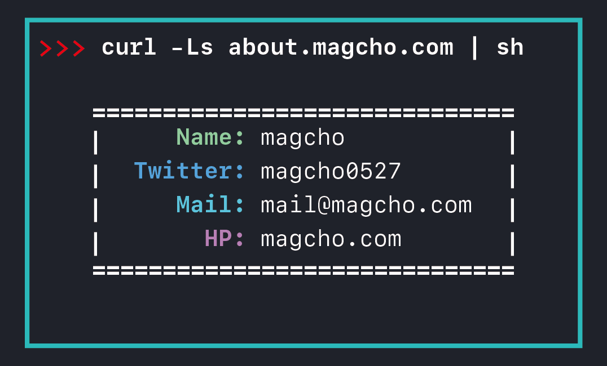

# about

This script is meant for show magcho's self-introduction.
magchoが自己紹介をするだけのシェルスクリプト

[](https://app.netlify.com/sites/about-magcho/deploys)


# usage

```bash
$ curl -Ls about.magcho.com | sh

# execute sub command
$ curl -Ls about.magcho.com | sh -s (help|more|tw|hp)
```

 
